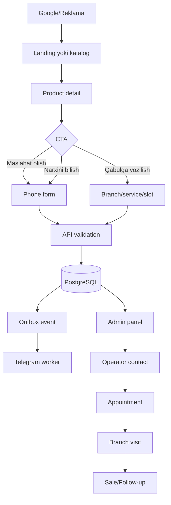

# User Flows

## 1. Hearing aid product lead



## 2. Appointment booking

1. User service tanlaydi.
2. Branch tanlaydi.
3. Optional specialist tanlaydi.
4. API mavjud slotlarni qaytaradi.
5. User slot, ism va telefonni yuboradi.
6. API idempotency key va double-bookingni tekshiradi.
7. Transaction ichida Lead + Appointment + OutboxEvent yaratiladi.
8. Success page appointment reference ko‘rsatadi.
9. Telegram worker tegishli chatga yuboradi.
10. Operator admin panelda tasdiqlaydi.

## 3. IEM consultation

```text
IEM landing
→ model/features comparison
→ process explanation
→ centre visit requirement
→ branch appointment
→ consultation
→ ear impression/scan
→ model and design selection
→ production tracking (admin/internal)
→ quality control
→ handover
```

## 4. Admin lead handling

```text
NEW
→ assigned to operator
→ NEEDS_CONTACT
→ CONTACTED
→ APPOINTMENT_BOOKED or FOLLOW_UP
→ VISITED
→ SALE_COMPLETED / CANCELLED / INVALID
```

Har bir transition:

- kim bajargani;
- oldingi/yangi status;
- vaqt;
- optional note

bilan historyga yoziladi.

## 5. Telegram failure

```text
Outbox pending
→ Telegram request
→ failure
→ exponential retry
→ max attempts
→ dead letter
→ admin alert/manual retry
```

Leadning o‘zi Telegram xatosi tufayli yo‘qolmaydi.
